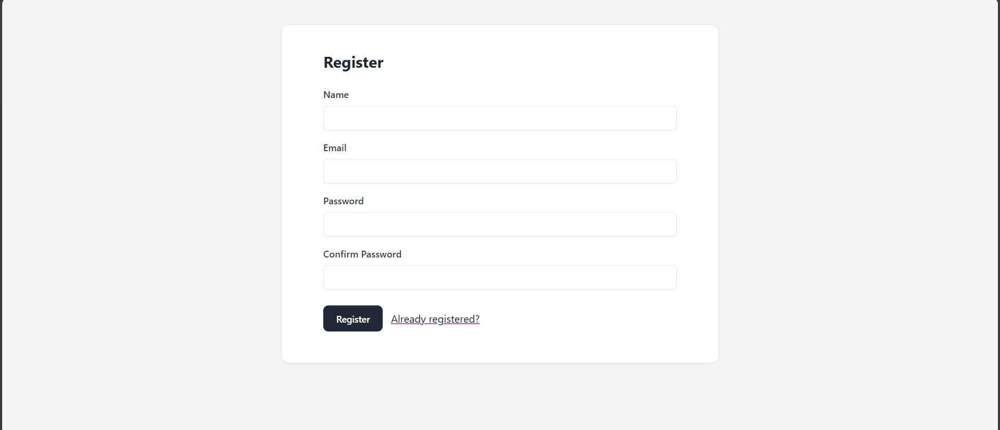
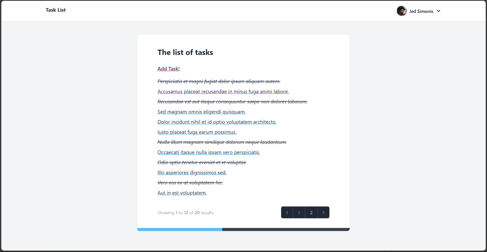
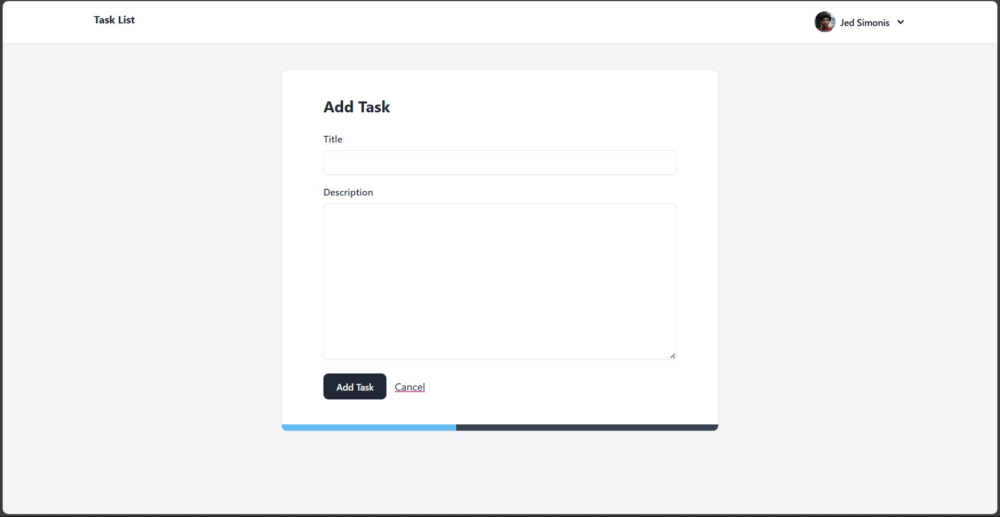
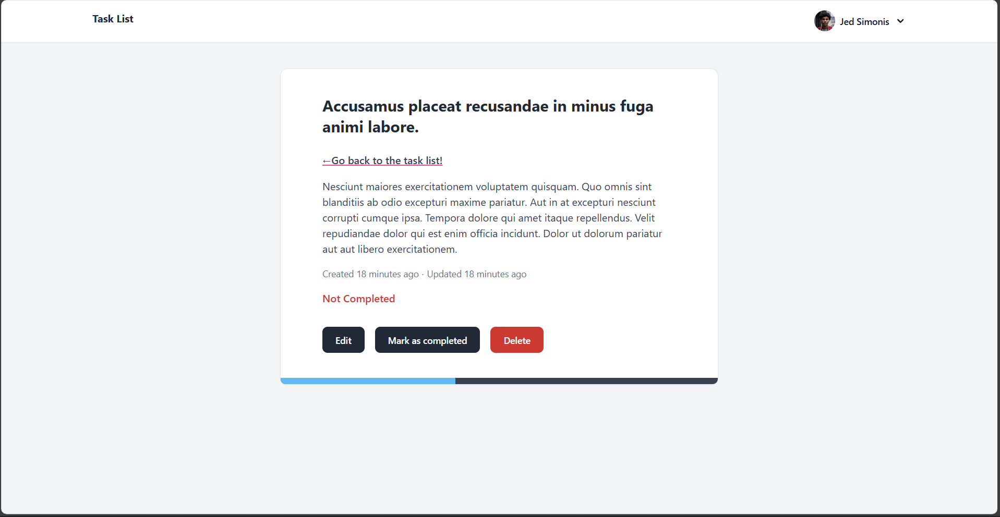

# Task list

    

Welcome to the Simple Task List App, a Laravel-based application designed to help users manage their tasks efficiently. This project serves as a foundation for a more comprehensive task management system that I plan to expand in the future.

## Features

- **User Registration and Authentication**: Users can register, log in, and manage their account securely.

- **Create Tasks**: Users can create tasks that they want to complete, providing a title and description for each task.

- **Update Tasks**: Users can edit the content of their existing tasks to keep their information up-to-date.

- **Delete Tasks**: Users can remove tasks that are no longer needed.

- **Mark Tasks as Complete**: Users can mark tasks as complete to track their progress.

- **Progress Bar**: A visual progress bar that shows the percentage of tasks completed by the user, providing a quick overview of their productivity.

## Future Plans
I plan to extend the functionality of this app significantly in the future. Some of the upcoming features include:

- **Chat Room**: Introduce a chat room feature to facilitate communication between users.

- **Enhanced Task Management**: Add more detailed task management options such as deadlines, priorities, and categories.

- **Collaborative Features**: Allow users to share tasks and collaborate with others on projects.

- **Notification System**: Implement a notification system to remind users of upcoming deadlines and task updates.

- **Advanced Analytics**: Provide users with detailed analytics on their task completion and productivity trends.

## Images

### Register user

### Show all user tasks

### Create task

### Mark task as complete & more

